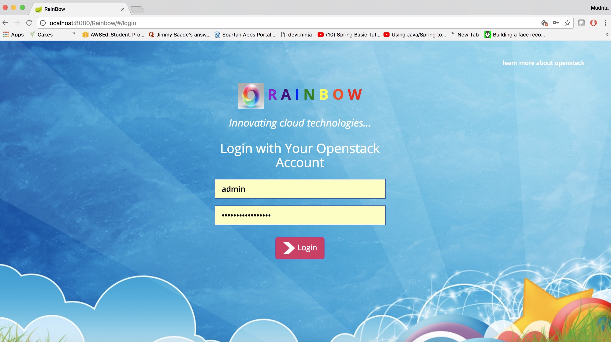
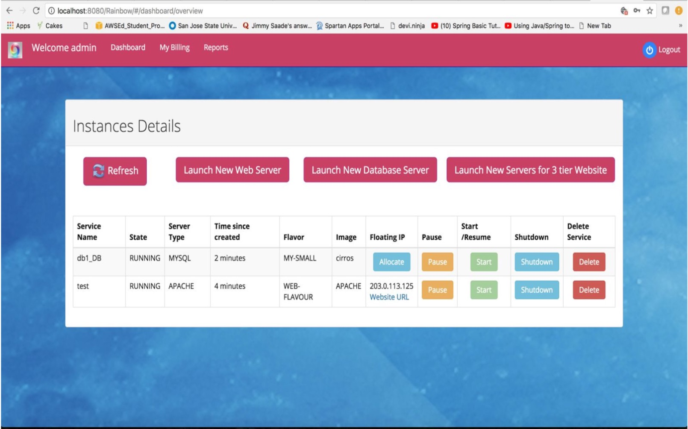
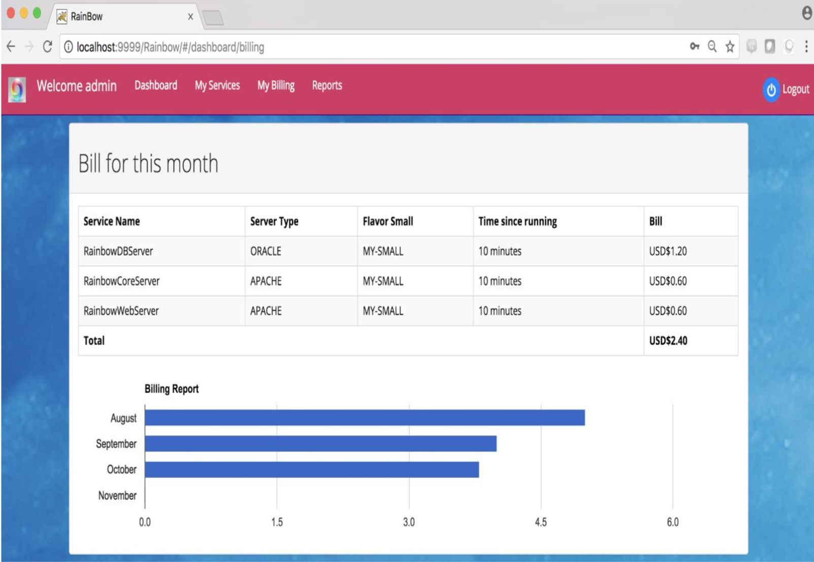
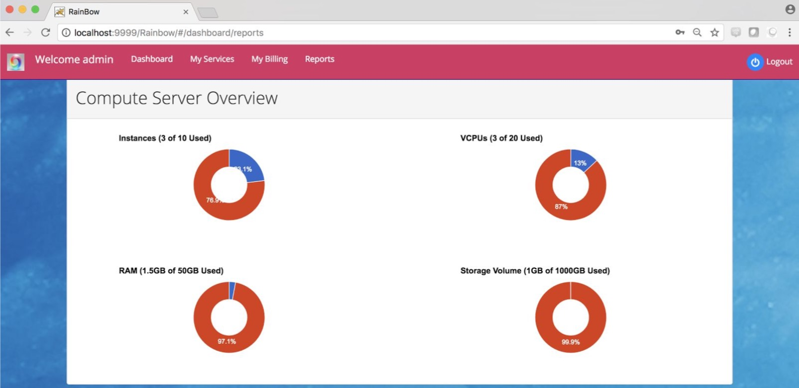

# Rainbow

## Introduction

    This product implements creating, launching & monitoring of Virtual Machines using OpenStack and its provided APIs.
    It helps in creating virtual machines using pre-configured flavors for servers,
    which in turn launches pre-configured web-server and database servers.
    It also calculates and exposes the pricing of the various servers running based on the amount of time they have run.
    The monitoring tool gives an overview of the number of instances launched and usage based on
    ● number of vCPUs
    ● RAM
    ● Storage.
    
## To run the project on local

## Prerequisites:

    1. Maven
    2. Java
    3. Eclipse or Intellij IDE
    4. Openstack Controller and Compute node in running state
    
    
## Run on local

    1. Clone or download and unzip the project
    2. Go to the directory which contains pom.xml file
    3. Execute command :
        mvn clean install
    4. Open the project in eclipse (same directory that contains pom.xml)
    5. Right click -> Run As -> Run on server.
    6. Open browser at http://localhost:8080/Rainbow
    
## Login Page
    
   
    
    
## Dashboard window
    
   
    
    
##  Billing Page
    
   
    
    
## Reports Page
    
   
    
    

